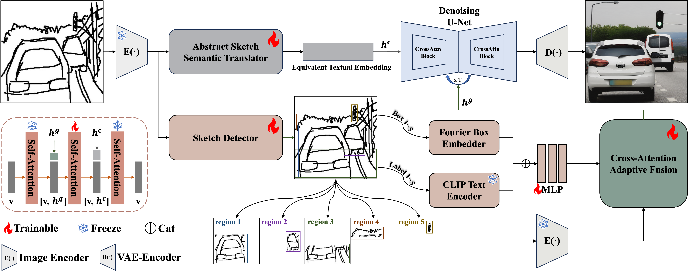
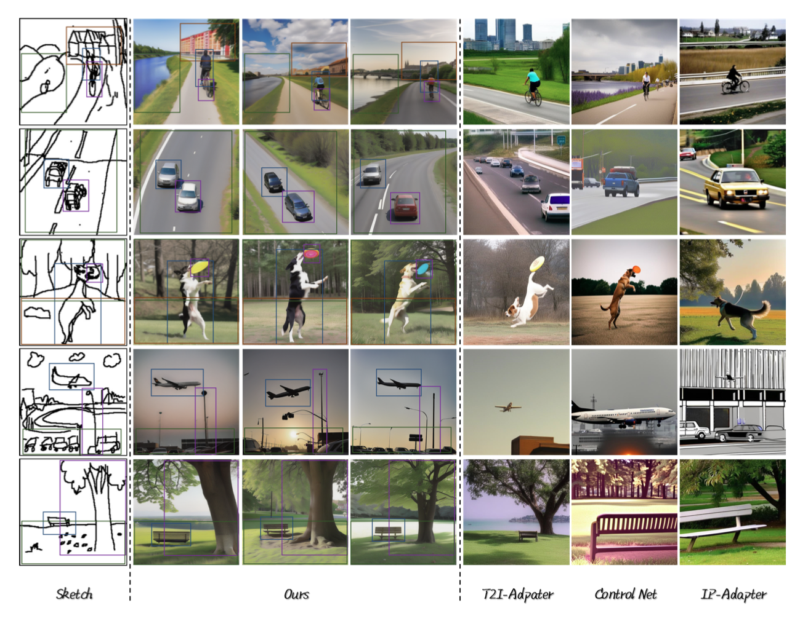
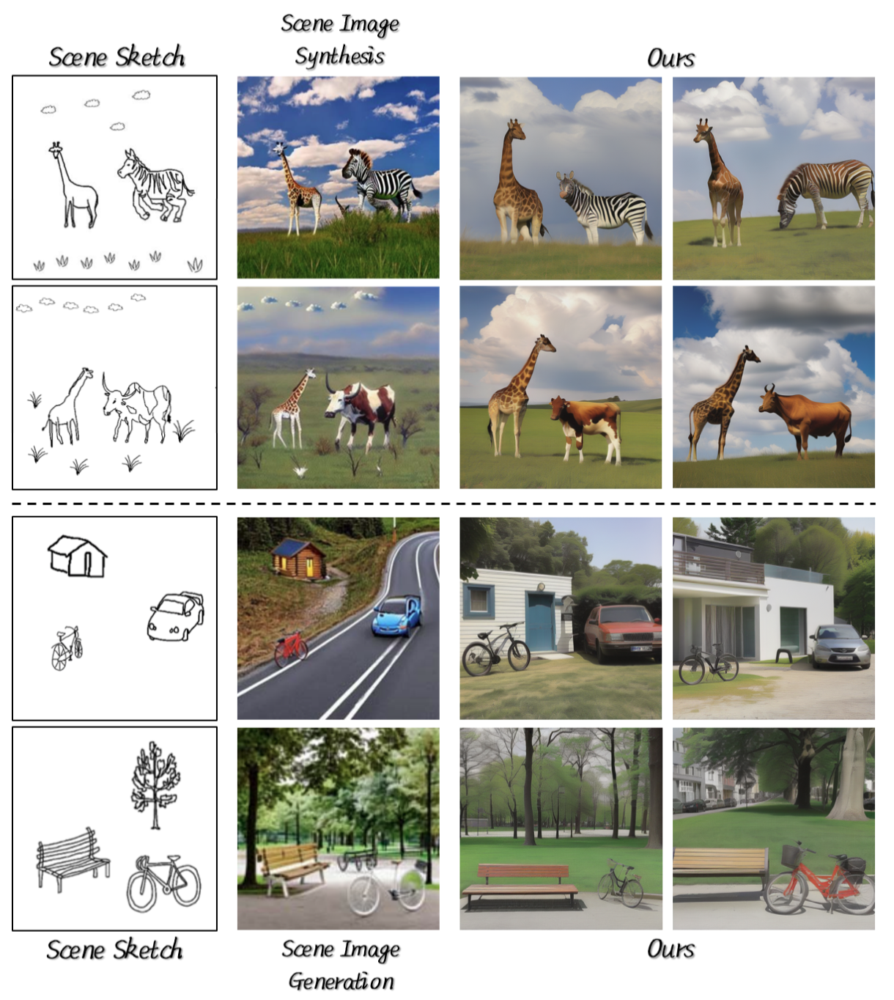

# SketchMaster: From Rough Lines to Photorealistic Scenes with Adaptive Guidance

This repository contains the supplementary material and Markdown project page for our paper:

**"SketchMaster: From Rough Lines to Photorealistic Scenes with Adaptive Guidance"**

## Overview

Overview of our proposed framework for abstract sketch-to-image generation.
Given an input abstract scene sketch, we extract equivalent textual embeddings as well as region-specific bounding boxes and labels, then fuse them via adaptive cross-attention to guide the diffusion model.
This results in a realistic scene image that aligns with the input sketch.

## Abstract
Scene sketch-to-image generation demands tight alignment between an abstract sketch and its generated image in terms of semantics, layout, shape, and details.
However, existing diffusion-based approaches often fail to capture the nuanced information conveyed by complex sketches, resulting in low-quality or unrealistic outputs.
In this paper, we present a novel framework that achieves robust cross-modal understanding and adaptive sketch guidance from a single abstract scene sketch.
Specifically, we introduce an Abstract Sketch Semantic Translator to convert sketch features into fine-grained textual embeddings, enabling precise semantic conditioning for the diffusion model.
We also incorporate layout-aware detection to extract bounding boxes and labels from the sketch, fusing them with local object features via cross-attention.
By combining these refined textual embeddings and layout-guided features within the denoising process, our method generates realistic scene images closely aligned with the original sketches.
Extensive experiments demonstrate that our framework excels at interpreting abstract sketches and producing high-fidelity results with accurate semantic and spatial consistency.

## Methods

Overall pipeline of our proposed framework.
Given an abstract scene sketch, the Abstract Sketch Semantic Translator (top) progressively converts raw sketch features into equivalent fine-grained textual embeddings \( \boldsymbol{h^{c}} \) for diffusion-based generation.
Meanwhile, a Sketch Detector (bottom) identifies object bounding boxes and labels, extracting layout and local detail features, which are fused via cross-attention to produce \( \boldsymbol{h^{c}} \).
During generation, \( \boldsymbol{h^{c}} \) provides global semantic guidance, while \( \boldsymbol{h^{g}} \) offers object-level control, yielding coherent, realistic scene images aligned with the sketch.

## Comparison of Scene Layout Consistency

Qualitative results and comparison with other SOTA methods.
Our proposed method is capable of generating high-quality, realistic scene images that align with the semantics and layouts of the scene sketches.
The annotated bounding boxes demonstrate the correspondence between our results and sketches.

## Comparison of Photorealism and Coherence

Qualitative comparison with Scene Image Synthesis and Scene Image Generation.
Our method produces noticeably more realistic, unified scenes, integrating objects seamlessly with the environment and avoiding the segmented appearance observed in other methods.

## More Results

More results generated by our proposed method in the FS-COCO dataset.

## Repository Contents
- `README.md`: Markdown project page and supplementary description.
- `static/images/`: Figures used in this README.

